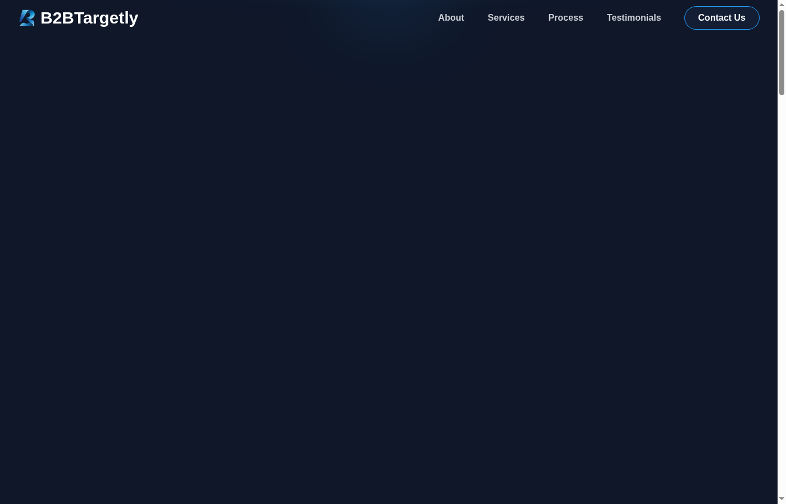

<div align="center">
  

  <h1>B2BTargetly</h1>

  <p><strong>B2B Lead Generation & Data Solutions — Landing Page</strong></p>

  <p>
    <a href="https://b2btargetly.com/" target="_blank">🌐 Live Site</a> &nbsp;|&nbsp;
    <a href="#getting-started">🚀 Getting Started</a> &nbsp;|&nbsp;
    <a href="#tech-stack">🛠 Tech Stack</a>
  </p>
</div>

---

## Screenshot



---

## Overview

**B2BTargetly** is a professional landing page for a B2B lead generation and data analysis agency. It showcases services, client testimonials, the work process, and a contact form — all wrapped in a modern dark-themed design with smooth scroll animations.

> At B2BTargetly, we help businesses grow by turning data into valuable deals. With 1,200+ successful projects and 180+ happy clients across 20+ countries, we are a Top-Rated provider on platforms like LinkedIn.

---

## Features

- ✨ **Animated hero section** with rotating 3D globe and scroll-triggered fade-ins
- 📋 **Services showcase** — Lead & Data, Creative & Marketing, Web & App Solutions
- 📊 **Animated statistics** counters (1,200+ projects, 180+ clients, 20+ countries)
- 💬 **Client testimonials** carousel
- 🔄 **Work process** timeline
- 📬 **Contact form** with Zod validation
- 📱 **Fully responsive** — mobile-first with sheet-based navigation
- 🌙 **Dark theme** with purple/blue gradient design system

---

## Tech Stack

| Layer | Technology |
|---|---|
| Framework | [Next.js 13](https://nextjs.org/) (Pages Router, static export) |
| Language | TypeScript |
| Styling | [Tailwind CSS v4](https://tailwindcss.com/) |
| UI Components | [shadcn/ui](https://ui.shadcn.com/) |
| Animations | CSS Intersection Observer (`useInView` hook) |
| Validation | [Zod](https://zod.dev/) |
| Package Manager | pnpm |

---

## Getting Started

### Prerequisites

- Node.js 18+
- pnpm

### Installation

```bash
# Clone the repository
git clone https://github.com/zaberhossen/b2btargetly.git
cd b2btargetly

# Install dependencies
pnpm install --ignore-scripts

# Start the development server (port 9002)
pnpm dev
```

Open [http://localhost:9002](http://localhost:9002) in your browser.

### Build

```bash
# Production build (static export)
pnpm build
```

The output is exported to the `out/` directory.

---

## Project Structure

```
src/
├── app/
│   ├── page.tsx          # Main single-page layout
│   ├── globals.css       # Design tokens & custom utilities
│   └── actions.ts        # Server actions (contact form)
├── components/
│   ├── layout/           # Header, Footer
│   ├── sections/         # Page sections (hero, about, services, …)
│   ├── ui/               # shadcn/ui primitives
│   └── section-wrapper.tsx  # Scroll animation wrapper
└── hooks/
    └── use-in-view.ts    # Intersection Observer hook
```

---

## Live

🔗 **[https://b2btargetly.com/](https://b2btargetly.com/)**

---

<div align="center">
  <sub>Built with ❤️ by <a href="https://github.com/zaberhossen">zaberhossen</a></sub>
</div>
